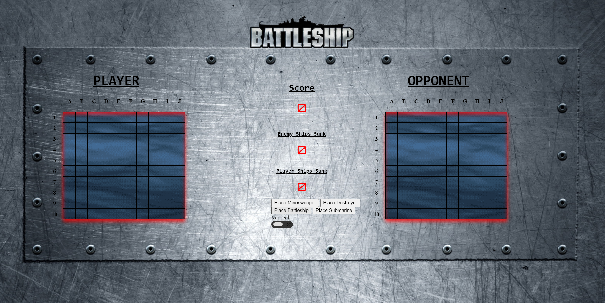
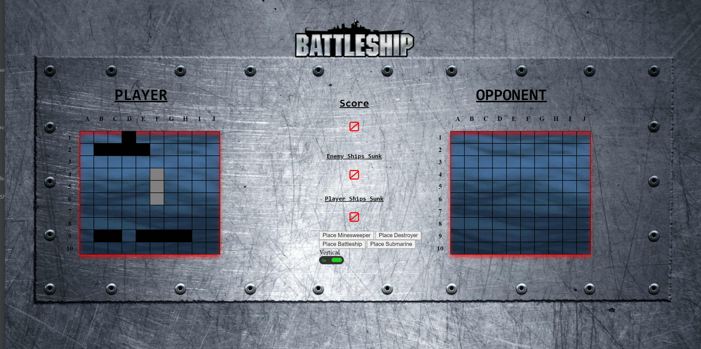
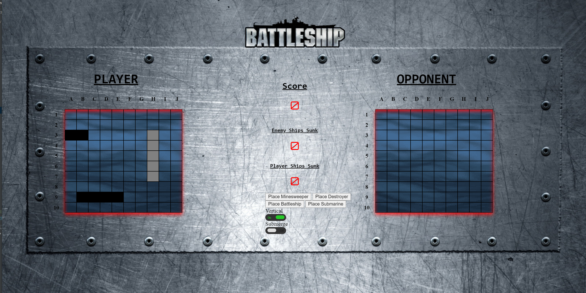
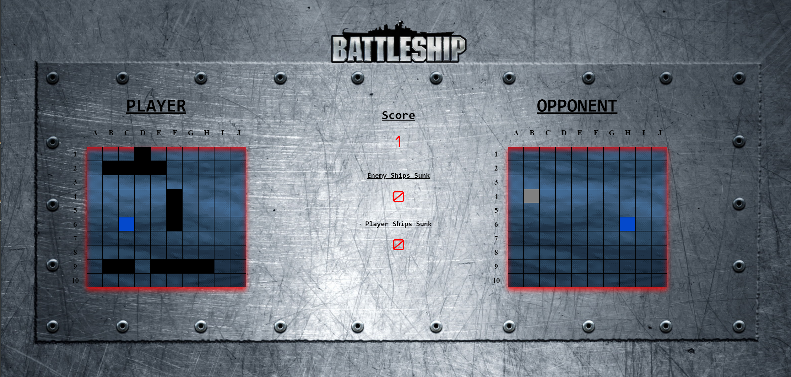
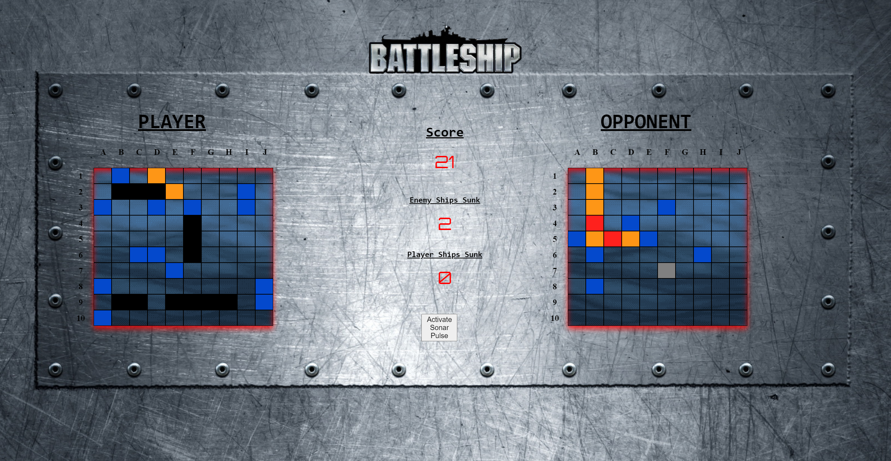
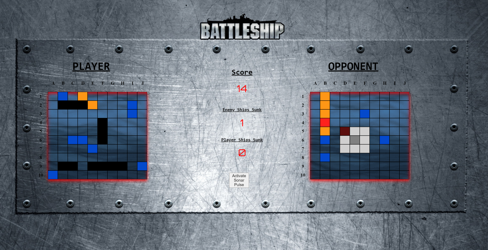

# My BattleShip Game
After class additions for our Software Engineering project

A much better and improved version of the Battlefield game. This started off as a project for my OSU CS361 course, but grew into more of a passion project.
I forked this repo from my team's previous version of this game: https://github.com/cs361fall2018/project-team-11

### Built With
* [InteliJ](https://www.jetbrains.com/idea/)
* [Ninja Framework](https://github.com/ninjaframework/ninja)
* [Maven Framework](https://maven.apache.org/guides/introduction/introduction-to-plugins.html)

### Configuring InteliJ IDEA and Importing Maven-based Projects
1) Clone this repository to your local system.

2) Download and install [IntelliJ IDEA Community Edition](https://www.jetbrains.com/idea/download/#section=windows).

3) Launch IntelliJ IDEA. The initial launch has configuration steps, complete these as needed, and get to the Welcome to IntelliJ IDEA screen.

4) Select the Import Project option.

5) From the file browser window, navigate to the repository that you cloned to your local system in steps 1-3, and select the pom.xml file within the main project folder. Select the Open button to continue.

6) If this is a clean installation of IntelliJ IDEA, you will need to add a Java SDK in order for IntelliJ IDEA to be able to compile Java source code. Typically when loading a new project in IntelliJ IDEA a popup dialog will appear indicating that the project does not have an SDK configured for it; this dialog will all provide options for adding and configuring an SDK for that project.

7) If you do not currently have a copy of the Java SDK installed on your system, you will first need to download and install the [Java Platform (JDK) from Oracle](https://www.oracle.com/java/technologies/javase-downloads.html).

8) If the SDK configuration dialog did not appear, or you closed out of it, the appropriate menu for adding a Java SDK to IntelliJ IDEA can be found by going to File -> Project Structure... and selecting the SDK option under the Platform Settings group on the left-hand side of the window. Select the + icon at the top of the middle pane, and the JDK option.

9) The JDK option will launch a file browser window. Navigate to the location of the installed Java SDK and select the jdk-10.0.2.jdk folder (version numbers and the folder name might be slightly different on your system) before selecting the Open button. Note: For macOS users, the Java SDK folder is typically located in /Library/Java/JavaVirtualMachines/.

10) Once added, select the Project option under the Project Settings group on the left-hand side of the window. Select the drop-down menu under Project SDK in the main pane and a 10 or similarly named instance of the Java SDK should be available; select it and click OK.

Your project should now be properly configured for development and use from within IntelliJ IDEA.

## Screenshots
#### Main Start Screen  

#### Start of Ships  

#### Placing Ships  

#### Early Game  

#### Mid Game  

#### Sonar Pulse Weapon  

## Contributing
Contributions are what make the open source community such an amazing place to be learn, inspire, and create. Any contributions you make are **greatly appreciated**.
1. Fork the Project
2. Create your Feature Branch (`git checkout -b feature/AmazingFeature`)
3. Commit your Changes (`git commit -m 'Add some AmazingFeature'`)
4. Push to the Branch (`git push origin feature/AmazingFeature`)
5. Open a Pull Request

## Contact 
Carson Pemble - [LinkedIn](https://www.linkedin.com/in/carson-pemble/) - pemblec@oregonstate.edu - pemblec.github.io
Porfolio Link: [https://pemblec.github.io/](https://pemblec.github.io/)
